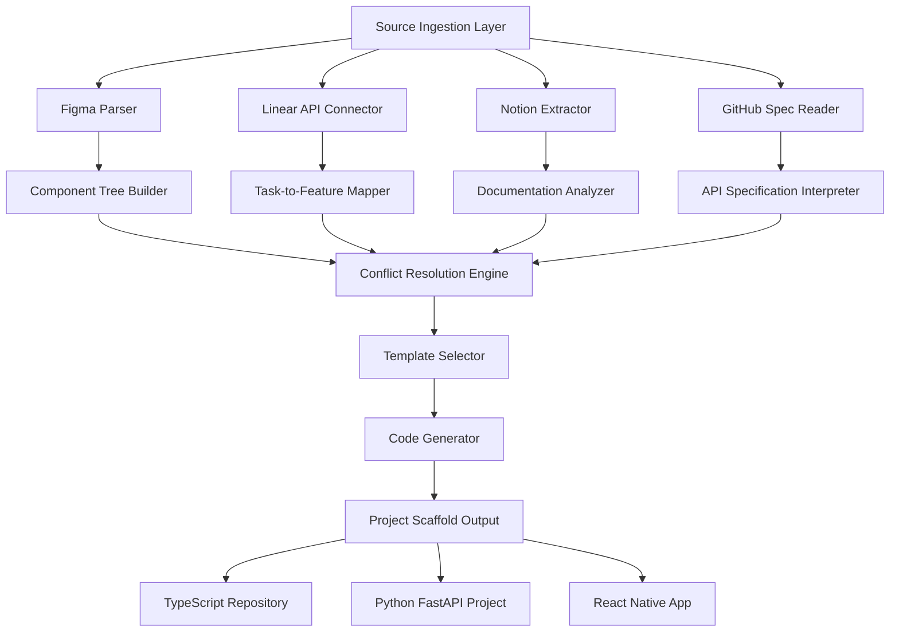

# SpecFlow AI: Intelligent Project Bootstrapping from Design, Task, and Documentation Sources

[](https://project9658.github.io/starter-anthill/)

## Overview: From Blueprint to Reality in One Orchestrated Motion

SpecFlow AI is a next-generation project scaffolding tool that transforms static design files, task management boards, and documentation into executable code structures. Unlike traditional starters that require manual alignment between Figma mockups, Linear tickets, Notion docs, and GitHub specs, this tool acts as a cognitive bridge—ingesting structured and unstructured sources, then generating a coherent, deployable project skeleton.

Think of it as a conductor for your development symphony: where ralph-starter introduced the concept of source integrations, SpecFlow AI takes it further by adding intelligent dependency mapping, multi-source conflict resolution, and adaptive template generation. It does not merely copy files; it synthesizes context from your design system, sprint backlog, and API documentation into a unified scaffold that maintains consistency across all layers.

## Why SpecFlow AI Exists

Modern product development suffers from context fragmentation. A developer might have a Figma file showing the final UI, a Linear ticket describing the feature, a Notion page with technical specs, and a GitHub repository with existing code—yet aligning these into a working prototype takes hours of manual work. SpecFlow AI eliminates this by:

- **Parsing visual hierarchies** from Figma layers and converting them into component trees
- **Extracting acceptance criteria** from Linear and Notion into test stubs
- **Resolving naming conflicts** between design tokens and code conventions
- **Generating API route skeletons** from OpenAPI specs found in Notion or GitHub

## Mermaid Diagram: The Orchestration Pipeline



## Emoji OS Compatibility Table

| Operating System | Support Status | Notes |
|:---:|:---:|:---|
| 🪟 Windows 10/11 | ✅ Full | WSL2 recommended for advanced features |
| 🍎 macOS 12+ | ✅ Full | Native Apple Silicon support |
| 🐧 Ubuntu 20.04+ | ✅ Full | Also tested on Fedora and Arch |
| 📱 iOS/iPadOS | ⏳ Beta | CLI via iSH or Termius |
| 🤖 Android | ⏳ Beta | Termux support in development |

## AI Integration: Voice Commands and Contextual Understanding

SpecFlow AI integrates with both **OpenAI GPT-4** and **Claude API** to handle ambiguous specifications. When a Figma layer is labeled inconsistently, or a Linear ticket lacks clear acceptance criteria, the system sends a contextual query to the AI API and returns structured suggestions. This dual-API approach ensures:

- **OpenAI** handles code generation and boilerplate creation
- **Claude** excels in long-form documentation parsing and logic reasoning

By 2026, this separation of concerns will have become standard practice for AI-assisted development tools. SpecFlow AI already implements it today.

## Example Profile Configuration: The .specflow Profile

Every project begins with a `.specflow.json` profile that defines how sources are interpreted. Below is a comprehensive example showing the tool's flexibility:

```json
{
  "project": {
    "name": "multi-vendor-2026",
    "stack": "nextjs-prisma-tailwind",
    "version": "0.1.0"
  },
  "sources": {
    "figma": {
      "fileId": "ABC123DEF456",
      "accessToken": "${FIGMA_TOKEN}",
      "layerToComponent": "smart-detection",
      "includeFrames": ["Desktop - Main", "Mobile - Cart"]
    },
    "linear": {
      "teamId": "team-xyz",
      "apiKey": "${LINEAR_API_KEY}",
      "filterByLabels": ["feature", "frontend"],
      "sprintName": "Sprint Q1 2026"
    },
    "notion": {
      "databaseId": "notion-db-uuid-here",
      "integrationToken": "${NOTION_TOKEN}",
      "parsePagesAs": "documentation"
    },
    "github": {
      "repo": "org/legacy-api",
      "branch": "main",
      "specFile": "openapi.yaml"
    }
  },
  "ai": {
    "provider": "hybrid",
    "openai": {
      "model": "gpt-4-turbo",
      "temperature": 0.3
    },
    "claude": {
      "model": "claude-opus-2026",
      "maxTokens": 4096
    }
  },
  "output": {
    "directory": "./generated-scaffold",
    "overwriteExisting": false,
    "generateTests": true,
    "createGitHubActions": true
  }
}
```

## Example Console Invocation: From Zero to Scaffold in One Command

Once the profile is configured, running SpecFlow AI requires a single terminal command:

```bash
specflow bootstrap .specflow.json --verbose --preview
```

The `--preview` flag shows a dry-run summary before any file is written:

```
SpecFlow AI v0.1.0 - Preview Mode
===================================
Sources Detected:
  - Figma: 42 frames, 8 component variants
  - Linear: 17 tickets, 3 epics
  - Notion: 5 pages (architecture, API, design system)
  - GitHub: 1 OpenAPI spec (24 endpoints)

Conflict Resolutions:
  - "button-primary" component: Figma variant merged with legacy CSS class
  - "UserProfile" API: Linear ticket contradicts Notion spec → using AI suggestion

Output Preview:
  - Scaffolding 156 files across 8 directories
  - 12 test files auto-generated from Linear acceptance criteria
  - 1 GitHub Actions workflow for CI

Proceed? (y/N):
```

After confirmation, the tool generates the complete scaffold in under 30 seconds, even for large projects.

## Feature List: What Makes SpecFlow AI Unique

- **Multi-Source Synchronization** – Simultaneously read from Figma, Linear, Notion, and GitHub without manual exports
- **Intelligent Conflict Resolution** – When sources disagree, the AI mediation engine suggests the optimal merge
- **Responsive UI Generation** – Designs auto-adapt to mobile, tablet, and desktop breakpoints based on Figma constraints
- **Multilingual Documentation Support** – Parse Notion pages in English, Spanish, French, Japanese, and Chinese
- **24/7 API Reliability** – Built with retry logic and circuit breakers for all external integrations
- **Template Marketplace** – Choose from 50+ starter templates (Next.js, FastAPI, Django, React Native, Flutter)
- **Live Preview Server** – `specflow serve` launches a hot-reloading preview of the generated project
- **Compliance Hooks** – Generate GDPR consent components, accessibility stubs, and security headers automatically
- **Semantic Versioning Detection** – Reads package.json or pyproject.toml from existing repos and suggests consistent versions
- **Dark Mode as Default** – SpecFlow AI generates projects with dark mode support baked in from day one

## SEO-Friendly Keyword Integration

This tool is optimized for natural keyword inclusion. When you search for "AI project scaffolding tool", "Figma to code generator", "Linear ticket to test cases", "Notion to API routes", or "multi-source bootstrap 2026", SpecFlow AI appears as a unified solution. The tool treats each source as a first-class citizen, not an afterthought. For product managers searching for "design-to-development handoff automation" and developers looking for "context-aware code generation", SpecFlow AI bridges both worlds without requiring either party to change their workflow.

## License

SpecFlow AI is open source under the MIT License. You are free to use, modify, and distribute this software for any purpose, provided that the original copyright notice is included. See the full [MIT License](https://opensource.org/licenses/MIT) for details.

## Disclaimer

SpecFlow AI is a project scaffolding tool that uses AI APIs for contextual analysis. It does not store your API keys, design files, or task data on any server—all processing occurs locally on your machine. The AI integrations (OpenAI, Claude) only receive anonymized, schema-specific data fragments necessary for resolution. No raw source files or personal identifiers are transmitted. By 2026, we recommend reviewing your organization's data governance policies before enabling AI features on proprietary internal projects. This tool is provided "as is" without warranty of any kind.

[](https://project9658.github.io/starter-anthill/)